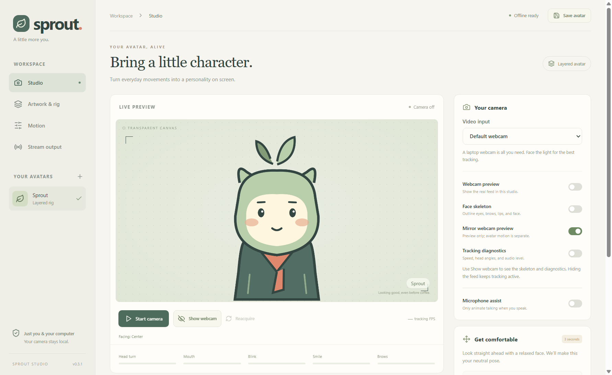

# Sprout — local PNGtuber studio

Previously named Luma. Sprout v0.3.1 updates the app branding, installer name, and repository to [sprout-pngtuber](https://github.com/wxyz404/sprout-pngtuber).

Sprout turns ordinary webcam movements into a PNG avatar on Windows. It includes a sample character, two rig modes, optional microphone gating, local profile storage, and transparent OBS output. No accounts or online processing are used.



## Install and use

Build the Windows installer with `pnpm run package`, or download a published installer from the repository Releases page when available. Packaging writes the installer to `../installers/`. The installer lets you choose a per-user installation location; this initial build is unsigned.

1. Open Sprout. Sprout, the bundled sample avatar, is ready to use.
2. Select a webcam and click **Start camera**. Camera preview is optional and stays inside the studio.
3. Look straight ahead with a relaxed, closed-mouth expression. Click **Calibrate neutral pose** and remain still for three seconds of valid tracking. Follow the movement check afterward.
4. In **Artwork & rig**, use **PNG poses** for complete images or **Layered rig** for independent facial parts. Click **Save changes** after editing or calibrating.
5. In **Stream output**, copy the source URL. In OBS, add a Browser source, paste the URL, and use 1024 × 1024 at 60 FPS. Keep Sprout open while streaming. OBS receives only the avatar.

Enable **Microphone assist** only if you want audio activity to gate talking animation. Webcam-only mode detects visible mouth opening; it cannot distinguish speech from yawning. Adjust the audio threshold if quiet speech or background noise activates it incorrectly.

## Webcam monitor (v0.2.0)

In **Studio → Your camera**, enable **Webcam preview** or click **Show webcam** beneath the avatar. The feed is hidden by default. Showing it does not start the camera; choose **Start camera** to grant webcam access. Hiding it keeps avatar tracking active; **Pause tracking** stops capture.

- **Face skeleton** independently outlines the tracked face, eyes, eyebrows, lips, and irises. It is off by default and clears when tracking is lost. It tracks the face driving the avatar, rather than every face in the room.
- **Mirror webcam preview** changes the feed and skeleton together, independently of the avatar's mirror-motion setting.
- **Enlarge webcam preview** gives you a wider view for alignment and calibration.
- **Tracking diagnostics** shows tracking FPS, last inference duration, actual camera dimensions, head angles, and microphone level when microphone assistance is enabled. Inference duration is not total animation latency.

These display settings apply to the current studio session. Video, landmarks, and diagnostics stay in the studio; OBS continues to receive artwork and derived avatar animation only. No second webcam stream or body/hand tracker is started.

## Artwork guide

### Facing states (v0.3.0)

In **Artwork & rig → Facing states**, **Directional sprite states** lets head turns select **Center**, **Left**, or **Right** artwork. Turn it off to always use centered artwork; blinking, smiling, talking, and restrained head motion still work. The setting is saved with each avatar. Existing profiles keep directional switching enabled.

Select a facing tab to import that state's artwork. **PNG poses** has a separate bank of resting, smile, surprised, talking, blinking, and combined talking/blinking poses for each facing. **Layered rig** has separate resting artwork per layer and separate eye, mouth, and brow variants per facing, including smile/blink and smile/talk combinations. All states share a layer's position, scale, and pivot; export matching transparent canvases.

Missing side expression artwork falls back to that side's resting artwork, then available centered artwork. **Preview facing artwork** lets you check a facing and its expression without a webcam, including while directional switching is disabled. This preview stays inside the studio; OBS follows live input and the saved directional-state setting. The sample includes basic left/right PNG poses; supply additional art for side-specific facial animation.

- PNG files must be readable, at most 20 MB, and at most 4096 × 4096 pixels.
- **PNG poses:** center/neutral/resting is required. Direction, expression, and talking/blinking variants are optional. Direction has priority, followed by surprise, smile, and neutral. Missing variants fall back to available artwork.
- **Layered rigs:** add body, head, eyes, brows, mouth, or accessory layers. Import matching transparent canvases for each layer's feature variants. Drag layers in edit mode, Shift-click to place the pivot, and adjust scale and draw order numerically. Eye, brow, and mouth movement inherits the head pivot. Body and accessories stay anchored.
- **Layer scaling:** The Scale slider resizes artwork around its image center. X/Y are saved corner coordinates, so they adjust as the image resizes. The slider limits its range to keep that center and valid profile coordinates; move an off-canvas layer inward if you need more scaling room. Existing profiles keep their saved placement.
- Sprout's parts use a shared 1024 × 1024 transparent canvas. Imported layers initially fit within 850 pixels; adjust their scale and position to match your own art.
- A single flat PNG supports position, rotation, and talking bounce. Additional artwork is needed to change the drawn eyes or mouth. Head turning cannot reconstruct a side view from front-facing artwork.
- Motion demo buttons affect the studio preview only. The OBS source continues to follow live input.

## Storage and recovery

Profiles, copied assets, calibration, and the persistent OBS token live in `%APPDATA%\luma-pngtuber`. Sprout keeps this original storage path and the original installer application ID so existing profiles remain available after upgrading from Luma. Back up the **entire** directory to move profiles to another computer. Profile asset references are relative, and imported original PNGs are never modified. Switching avatars saves pending edits; otherwise, save explicitly before closing. Physical installer upgrades still require validation; the application loading existing profile data is checked separately.

If the default output port (18743) is occupied, Sprout chooses another local port and shows a notice. Copy the updated URL into OBS. The chosen port is remembered. After an app restart, the output reconnects automatically when that port is available.

On face loss, the avatar holds briefly, then settles to neutral. The continuity lock does not deliberately follow a second person. After prolonged loss, use **Reacquire**. This is a spatial/shape continuity heuristic, not biometric identity recognition; another person in the same position with similar geometry can be mistaken for the original face.

For webcam denial, enable desktop camera access in Windows Settings. Close apps that are occupying the camera. Missing artwork produces a reimport message. Unsupported/corrupt profile files remain on disk, while other valid profiles can still load.

## Development

Requires Node.js 22+ and pnpm. The checked-in `public/` directory includes the model, WASM files, and sample PNGs; the packaged app does not download them at runtime.

```powershell
pnpm install
pnpm run assets  # regenerate sample art and copy WASM; download model only if missing
pnpm run test
pnpm run build
pnpm run start
pnpm run package
```

`scripts/smoke.cjs` uses Playwright's Electron API. Install Playwright as a development tool or set `SPROUT_PLAYWRIGHT` to its module location. Provide Google's MediaPipe `portrait.jpg` test fixture at `../../work/portrait.jpg` before running it. The script uses synthetic video, separate test profiles, software rendering, and a test-only `--no-sandbox` launch flag for constrained execution environments. It never requests the real webcam. Those flags are not added to the packaged application.

On restricted Windows environments where native esbuild cannot enumerate ancestor directories, run the build from a temporary `subst` drive mapped to this project, with symlink preservation enabled (already configured). Remove that mapping afterward. For example:

```powershell
subst L: "$PWD"
Push-Location L:\
pnpm run test
pnpm run build
Pop-Location
subst L: /D
```

Redirect cache paths into an allowed workspace if needed: Electron uses `electron_config_cache`; electron-builder uses `ELECTRON_BUILDER_CACHE`.

## Architecture

The sandboxed Electron renderer has a narrow preload bridge for profiles, PNG importing, clipboard copying, and publishing validated animation state. A classic dedicated worker runs bundled MediaPipe CPU/WASM inference, with one frame in flight. The motion engine handles calibration, smoothing, thresholds, and loss recovery; Canvas 2D renders both rig modes. Desktop preview and OBS import the same rendering code.

HTTP output binds only to `127.0.0.1`. Private artwork and the read-only WebSocket require the persistent output token. Studio access uses a separate per-launch token. IPC checks the sender window and frame; profile/state schemas reject invalid inputs. The server serves a fixed build-file map and profile-referenced PNGs, with no filesystem browser or control endpoints. Models and public build assets are served locally. Camera/audio data never enters the output server.

See [VALIDATION.md](VALIDATION.md) for the checks performed and the hardware acceptance work still outstanding.
